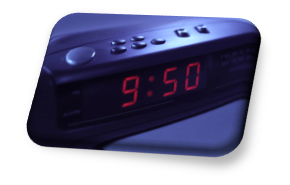
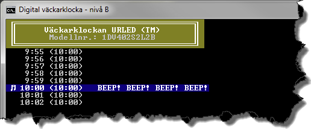

# Digital väckarklocka (A-, B-, och C-nivå)

Digitala klockor visar tiden med siffror. Två sorters visning förekommer:

* 24-timmars som visar 0:00 – 23:59
* 12 timmars som visar 1:00 – 12:59

Skriv ett program som simulerar en 24-timmars digital klockdisplay! Klassen klassen AlarmClock är "basen" i uppgiften, vilken kan utvecklas enligt de olika förutsättningarna för kravnivå A, B eller C. För att kontrollera att din "väckarklocka" fungerar på avsett sätt, ska även ett mindre test skrivas till varje program. 

__Utmana dig själv för att ta dig till uppgiftens C-nivå__! Det ger dig bra erfarenhet av att skriva klasser enligt goda objektorienterade principer, vilket du kommer att ha stor nytta av inför stegets examinationsuppgift!    

- [Uppgiftsbeskrivning på A-nivå:](a-niva/)

Figur 1: Kravnivå A

- [Uppgiftsbeskrivning på B-nivå:](b-niva/)

Figur 2: Kravnivå B

- [Uppgiftsbeskrivning på C-nivå:](c-niva/)

Figur 3: Kravnivå C