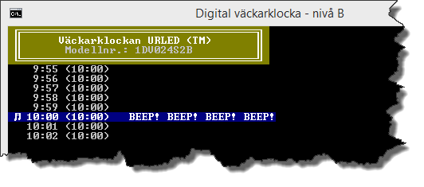
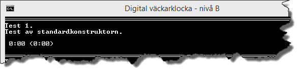
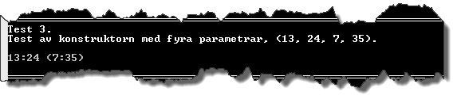
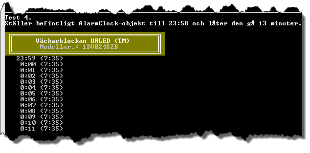
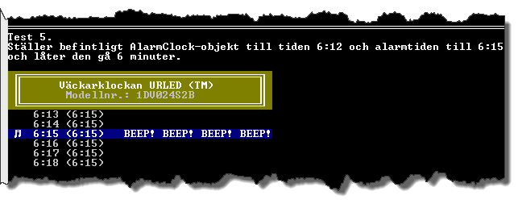
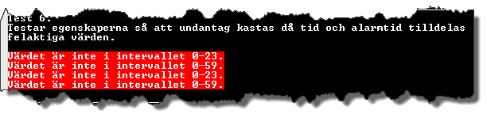
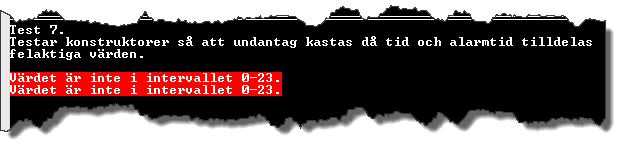
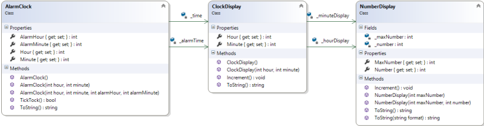
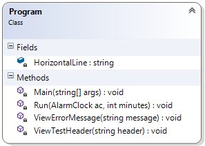

# Digital väckarklocka - nivå B

## Problem

Digitala klockor visar tiden med siffror. Två sorters visning förekommer:

* 24-timmars som visar 0:00 – 23:59
* 12 timmars som visar 1:00 – 12:59

Du ska skriva ett program som simulerar en 24-timmars digital klockdisplay, genom att skapa och använda dig av klasserna ```AlarmClock```, ```ClockDisplay``` och ```NumberDisplay```. Förutom att hålla ordning på aktuell tid ska klassen ```AlarmClock``` även kunna hantera en alarmtid. Du kontrollerar att klasserna fungerar som det är tänkt genom att skriva ett mindre test.  


Figur B.1. Exempel på resultat vid test av den digitala väckarklockan.

#####Väckarklockans delar

För att undvika att kod upprepas (dvs. bryter mot principen DRY, ”_Don’t Repeat Yourself_”), ska vår väckarklocka utgöras av flera klasser. Den klass som representerar väckarklockan byggs upp med hjälp av aggregat, vilket innebär att en klass innehåller fält med referenser till objekt av andra klasser.

Den egentliga väckarklockan ska representeras av klassen ```AlarmClock```. För att undvika upprepning av kod (redundans) ska ```AlarmClock``` innehålla två referenser till objekt av typen ```ClockDisplay```. Den ena instansen av ```ClockDisplay``` ska ansvara för den aktuella tiden; den andra ska ansvara för alarmtiden.

Objekt av typen ```ClockDisplay``` används för att hålla reda på timmar och minuter, och presentationen av dem. För att även undvika upprepning av kod som har med hantering av timmar och minuter att göra, ska klassen ```ClockDisplay``` innehålla två referenser till objekt av typen ```NumberDisplay```. Den ena instansen av ```NumberDisplay``` ska ansvara för timmarna; den andra ska ansvara för minuterna.

Instanser av klassen ```NumberDisplay``` ska ansvara för att ett värde håller sig inom ett givet intervall, som sträcker sig från 0 till ett givet maximalt värde. Beroende på om det är timmar eller minuter ser intervallet olika ut. I det slutna intervallet mellan 0 och 23 om det gäller timmar. I det slutna intervallet mellan 0 och 59 om det gäller minuter.

#####Hantering av timmar och minuter

Den digitala klockdisplayen ska presentera tiden i timmar och minuter, t.ex. 9:57. Värdet till vänster om kolontecknet är timmarna, som går från 0 till och med 23. Passeras 23 ska värdet sättas till 0. Värdet till höger är minuterna. Giltiga värden för dessa är 0 till och med 59. Passeras 59 ska värdet sättas till 0.

Det är ```ClockDisplay``` som tillsammans med ```NumberDisplay``` ansvarar för en korrekt textbeskrivning av en tid. Exempelvis ska tiden fem över sju på morgonen ge textbeskrivningen 7:05, medan fem minuter i nio på kvällen ska ge 20:55. Det handlar alltå om att låta en tidpunkt utgöras av två värden, som presenteras åtskilda av ett kolon (:). Dessa tidsvärden representeras av ```NumberDisplay-objekt```.  Med andra ord kan en tidpunkt hanteras med hjälp av två privata fält med referenser till ```NumberDisplay```-objekt i klassen ```ClockDisplay```.

Används ett ```NumberDisplay```-objekt  till att representera minuter, så ska textbeskrivningen av värdet inledas med 0 om värdet är mindre än 10. Används ett ```NumberDisplay```-objekt till att representera timmar ska _inte_ textbeskrivningen inledas med 0.

För att säkerställa att fält inte tilldelas felaktiga värden måste alla fält i klasserna kapslas in av lämpliga publika egenskaper. Även om klasserna ```AlarmClock``` och ```ClockDisplay``` innehåller egenskaper med ```set```-metoder räcker det om validering sker i ```NumberDisplay```, eftersom ```NumberDisplay```-objektet känner till vilket som är dess maximala värde. En ```set```-metod i klassen ```NumberDisplay``` ska därför kasta ett undantag om försök görs att tilldela en egenskap något ogiltigt värde.

#####Test av klasserna

För att säkerställa att klasserna ```AlarmClock```, ```ClockDisplay``` och ```NumberDisplay``` uppfyller ställda krav ska ett enklare test skrivas som visar detta. Testet ska innehålla kod som verifierar att konstruktorer, egenskaper och metoder fungerar. Efter att klassen ```AlarmClock```, ```ClockDisplay``` och ```NumberDisplay``` har implementerats ska testkoden skrivas i metoden ```Main()``` i klassen ```Program```. Testet ska bestå av sju deltester:

_Testlista_

1. Test av standardkonstruktor.
	
	För att kontrollera det nya objektets status, ska en sträng som representerar värdet av objektet skrivas ut. I konsolfönstret presenteras därmed "0:00 (0:00)" om standardkonstruktorn fungerar som den ska:
	
		
	Figur B.2.
	
2. Test av konstruktorn med två parametrar.
	
	Argumenten 9 och 42 ska användas då ett nytt objekt skapas. Tiden som ska skrivas ut är "9:42 (0:00)".
	
		
	Figur B.3.
	
3. Test av konstruktorn med fyra parametrar.
	
	Argumenten 13, 24, 7 och 35 ska användas då ett nytt objekt skapas. Tiden som ska skrivas ut är "13:24 (7:35)".
	
		
	Figur B.4.
	
4. Test av metoden ```TickTock()``` som ska låta klockan gå en minut.
	
	Ställ ett befintligt ```AlarmClock```-objekt till 23:58 och låt väckarklockan gå 13 minuter. Lista med 13 tider ska skrivas ut där minutvärdet ökar med en minut för varje tid.
	
	Timmar ska gå från 23 till 0 och i de fall timmar utgörs av ett ental ska timmen beskrivas med enbart en siffra. När minuterna är ental ska beskrivningen av minuten inledas med 0.
	
		
	Figur B.5.
	
5. Ställer befintligt ```AlarmClock```-objekt till tiden 6:12 och alarmtiden till 6:15 och låter klockan gå 6 minuter. Testkoden ska på lämpligt sätt indikera när ett alarm går.
	
		
	Figur B.6.
	
6. Test av egenskaperna så att undantag kastas då tid och alarmtid tilldelas felaktiga värden.
	
		
	Figur B.7.
	
	(Av felmeddelandena framgår inte att det första och andra meddelandet berör väckarklockans tid och det tredje och fjärde felmeddelandet berör väckarklockans alarmtid.)
	
7. Test av konstruktorer så att undantag kastas då tid och alarmtid tilldelas felaktiga värden.
	
		
	Figur B.8.
	
	(Av felmeddelandena framgår inte att det första meddelandet berörs väckarklockans tid och det andra felmeddelandet berör väckarklockans alarmtid.)
			
#####Klassdiagram över AlarmClock, ClockDisplay och NumberDisplay

Klasserna ```AlarmClock```, ```ClockDisplay``` och ```NumberDisplay``` måste implementeras så att de som minst innehåller medlemmarna enligt klassdiagrammet i Figur B.9 och har den funktionalitet som beskrivs för respektive klass och medlem.

Klasserna ```AlarmClock``` och ```ClockDisplay``` ser ut att inte ha några privata fält, då avdelningen _Fields_ saknas för klasserna i klassdiagrammet. Klasserna har dock fält och dessa symboliseras med så kallade _aggregat_.

Mellan ```AlarmClock``` och ```ClockDisplay``` finns två aggregat, ```_alarmTime``` och ```_time```. Dessa ska (i ```AlarmClock```-klassen) implementeras som privata fält som ska kunna referera till objekt av typen ```ClockDisplay```.

På samma sätt ska aggregaten ```_minuteDisplay``` och ```_hourDisplay``` mellan ```ClockDisplay``` och ```NumberDisplay``` implementeras i klassen ```ClockDisplay``` som privata fält, vilka ska kunna referera till objekt av typen ```NumberDisplay```.



Figur B.9. Klassdiagram för klasserna AlarmClock, ClockDisplay och NumberDisplay.

#####Klassen AlarmClock

_Fältet_ __alarmTime_

Privat fält som innehåller en referens till ett ```ClockDisplay```-objekt som ansvarar för alarmtiden. Kapslas in av egenskaperna ```AlarmHour``` och ```AlarmMinute```.

_Fältet_ __time_

Privat fält som innehåller referens till ett ```ClockDisplay```-objekt som ansvarar för väckarklockans aktuella tid. Kapslas in av egenskaperna ```Hour``` och ```Minute```.

_Egenskapen AlarmHour_

Publik egenskap, som kapslar in det privata fältet ```_alarmTime``` och dess egenskap ```Hour```.

_Egenskapen AlarmMinute_

Publik egenskap, som kapslar in det privata fältet ```_alarmTime``` och dess egenskap ```Minute```.

_Egenskapen Hour_

Publik egenskap, som kapslar in det privata fältet ```_time``` och dess egenskap Hour.

_Egenskapen Minute_

Publik egenskap, som kapslar in det privata fältet ```_time``` och dess egenskap ```Minute```.

_Konstruktorerna_

Konstruktorerna, som är tre till antalet, ska se till att ett ```AlarmClock```-objekt blir korrekt initierat. Det innebär att fälten ska initieras med lämpliga värden.

Standardkonstruktorn ```AlarmClock()``` ska initiera fälten till deras standardvärden. Ingen tilldelning får ske i konstruktorns kropp, som måste vara tom. Denna konstruktor måste därför anropa den konstruktor i klassen som har två parametrar.

Med konstruktorn ```AlarmClock(int hour, int minute)``` ska ett objekt kunna initieras så att alarmklockan ställs på den tid som parametrarna för timme respektive minut anger. Ingen tilldelning får ske i konstruktorns kropp, som måste vara tom. Denna konstruktor måste därför anropa den konstruktor i klassen som har fyra parametrar.

Med konstruktorn ```AlarmClock(int hour, int minute , int alarmHour, int alarmMinute)``` ska ett objekt kunna initieras så att alarmklockan ställs på den tid och alarmtid som parametrarna anger. Detta är den enda av konstruktorerna som får innehålla kod som leder till att fält i klassen tilldelas värden.

_Metoden TickTock_

Publik metod som anropas för att få klockan att gå en minut, t.ex. från 9:42 till 9:43. Om den nya tiden överensstämmer med alarmtiden ska metoden returnera ```true```, annars ```false```. Inga utskrifter till konsolfönstret får göras av metoden.

_Metoden ToString_

Publik metod som representerar värdet av en instans av klassen. Den har som uppgift att beskriva aktuellt ```AlarmClock```-objekt i form av en returnerad sträng innehållande aktuell tid samt alarmtiden inom parenteser. Inga utskrifter till konsolfönstret får göras av metoden.

#####Klassen ClockDisplay

_Fältet_ __hourDisplay_

Privat fält som innehåller en referens till ett ```NumberDisplay```-objekt. Detta ansvarar för timmarna och dess maxvärde ska därför sättas till 23. Kapslas in av egenskapen ```Hour```.

_Fältet_ __minuteDisplay_

Privat fält som innehåller en referens till ett ```NumberDisplay```-objekt. Detta objekt ska representera minuter, varför dess maxvärde ska sättas till 59. Kapslas in av egenskapen ```Minute```.

_Egenskapen Hour_

Publik egenskap, som kapslar in det privata fältet ```_hourDisplay``` och dess egenskap ```Number```.

_Egenskapen Minute_

Publik egenskap, som kapslar in det privata fältet ```_minuteDisplay``` och dess egenskap ```Number```.

_Konstruktorerna_

Konstruktorerna, som är två till antalet, ska se till att ett ```ClockDisplay```-objekt blir korrekt initierat. Det innebär att fälten ska initieras med lämpliga värden.

Standardkonstruktorn ```ClockDisplay()``` ska se till att fälten initieras så de refererar till ```NumberDisplay```-objekt men ingen tilldelning får ske i konstruktorns kropp, som måste vara tom. Denna konstruktor måste därför anropa den konstruktor i klassen som har två parametrar.

Med konstruktorn ```ClockDisplay(int hour, int minute)``` ska ett objekt initieras så att objektet ställs på den tid som parametrarna anger. Detta är den enda av konstruktorerna som får innehålla kod som leder till att fält i klassen tilldelas värden.

_Metoden Increment_

Publik metod, vars uppgift är att få ```ClockDisplay```-objektet att gå en minut. Ett anrop av metoden ska leda till att ```NumberDisplay```-objektet som representerar minuter går en minut, t.ex. från 9:42 till 9:43. Får detta objekt värdet 0 ska det andra ```NumberDisplay```-objektet, som representerar timmar, öka sitt värde. Inga utskrifter till konsolfönstret får göras av metoden.

_Metoden ToString_

Publik metod som har som uppgift att returnera en sträng, vilken representerar värdet av en instans av klassen ```ClockDisplay```. Strängen ska beskriva aktuell tid på formatet HH:mm, där minuterna ska inledas med 0 om värdet är mindre än tio. Timmarna ska inte inledas med 0 om de är mindre än tio. Inga utskrifter till konsolfönstret får göras av metoden.

#####Klassen NumberDisplay

_Fältet_ __maxNumber_

Privat fält som innehåller det maxvärde som numret kan anta. Kapslas in av egenskapen ```MaxNumber```.

_Fältet_ __number_

Privat fält som innehåller själva numrets värde. Kapslas in av egenskapen ```Number```.

_Egenskapen MaxNumber_

Publik egenskap, som kapslar in det privata fältet ```_maxNumber```. ```set```-metoden måste validera att värdet som ska tilldelas ```_maxNumber``` är större än 0. Är värdet inte det ska ett undantag av typen ```ArgumentException``` kastas.

_Egenskapen Number_

Publik egenskap, som kapslar in det privata fältet ```_number```. ```set```-metoden måste validera att värdet som ska tilldelas ```_number``` är i det slutna intervallet mellan 0 och maxvärdet. Är värdet inte det ska ett undantag av typen ```ArgumentException``` kastas.

_Konstruktorerna_

Konstruktorerna, som är två till antalet, ska se till att ett ```NumberDisplay```-objekt blir korrekt initierat. Det innebär att fälten ska initieras med lämpliga värden.

Konstruktorn ```NumberDisplay(int maxNumber)``` ska se till att fälten initieras så de refererar till ```NumberDisplay```-objekt men ingen tilldelning får ske i konstruktorns kropp, som måste vara tom. Denna konstruktor måste därför anropa den konstruktor i klassen som har två parametrar.

Med konstruktorn ```NumberDisplay(int maxNumber, int number)``` ska ett objekt initieras så att objektets fält tilldelas de värden som parametrarna har. Detta är den enda av konstruktorerna som får innehålla kod som leder till att fält i klassen tilldelas värden.

_Metoden Increment_

Publik metod som anropas för att få ```NumberDisplay```-objektet att (via egenskapen ```Number```) öka sitt nummer med 1. Om värdet, som fältet ```_number``` har, skulle bli större än värdet av fältet ```_maxNumber```, ska ```_number``` tilldelas värdet 0. Inga utskrifter till konsolfönstret får göras av metoden.

_Metoderna ToString_

```ToString()``` ska överlagras, dvs. det ska finnas två metoder med samma namn men med olika paramterlistor. Inga utskrifter till konsolfönstret får göras av någon av metoderna.

Uppgiften för den publika metoden ```ToString()```, vilken ärvs från basklassen ```Object```, är att returnera en sträng som representerar värdet av en instans av klassen ```NumberDisplay```. Strängen ska innehålla numret, utan att nummer mindre än tio inleds med 0.

Uppgiften för den överlagrade metoden ```ToString(string format)``` är att returnera en sträng, som representerar ```NumberDisplay```-instansens tidsvärde, i ett format som bestäms av parametern. Om argumentet i "format"-strängen är ”0” eller ”G” ska textbeskrivningen av numret inte inledas med 0. Är formatsträngen ”00” ska numret inledas med 0 i de fall som numret är mindre än tio. Alla övriga värden på formatsträngen ska leda till att ett undantag av typen ```FormatException``` kastas.

#####Klassen Program

Denna klass ska innehålla koden som testar klassen ```AlarmClock```. Figur B.10 visar ett förslag på medlemmar som kan användas för att skapa de sju testerna under rubriken ”Testlista” ovan. Klassen ```Program``` behöver inte på något tvingande sätt följa förslaget som enbart ska ses som en rekommendation. Det finns bara ett krav som måste uppfyllas och det är att metoden ```Main()``` måste se till att de sju deltesterna genomförs på avsett sätt.


Figur B.10. Förslag på medlemmar i klassen Program.

_Metoden Main_

Metoden ska instansiera objekt av klassen ```AlarmClock``` och testa konstruktorerna, egenskaperna och metoderna.

_Metoden Run_

Privat statisk metod som har två parametrar. Den första parametern är en referens till ett ```AlarmClock```-objekt. Den andra parametern är antalet minuter som ```AlarmClock```-objektet ska gå (vilket lämpligen görs genom att låta ett ```AlarmClock```-objekt göra upprepade anrop av metoden ```TickTock()```)

_Metoden ViewErrorMessage_

Privat statisk metod som tar ett felmeddelande som argument och presenterar det.


Figur B.11. Exempel på presentation av två felmeddelanden.

_Metoden ViewTestHeader_

Privat statisk metod som tar en sträng som argument och presenterar strängen.


Figur B.12. Exempel på ett tests rubrik inklusive horisontell linje ovan testrubriken.

## B-Krav

1. Klasserna ```AlarmClock```, ```ClockDisplay``` och ```NumberDisplay``` måste implementeras enligt klassdiagrammet i Figur B.9 samt följa tillhörande beskrivning av respektive medlemsmetod.
2. Ingen av medlemmarna i klasserna ```AlarmClock```, ```ClockDisplay``` och ```NumberDisplay``` får skriva ut något i konsolfönstret.
3. Det är bara den konstruktor i klasserna ```AlarmClock```, ```ClockDisplay``` och ```NumberDisplay``` som har flest parametrar som får tilldela värden till fält eller egenskaper.
4. Då ett nytt ```AlarmClock```-objekt instansieras ska undantag utlösas om försök görs att initiera objektet med ogiltiga värden (dvs. som inte ligger inom angivna intervall för timmar och minuter).
5. Klassen ```AlarmClock``` får inte innehålla någon kod som validerar parametrars värden. Validering ska ske genom aggregerade klasser.
6. Då ett nytt ```ClockDisplay```-objekt instansieras ska undantag utlösas om försök görs att initiera objektet med ogiltiga värden (dvs. som inte ligger inom angivna intervall för timmar och minuter).
7. Klassen ```ClockDisplay``` får inte innehålla någon kod som validerar parametrars värden. Validering ska ske i aggregerad klass.
8. Då ett nytt ```NumberDisplay```-objekt instansieras ska undantag kastas av klassen om försök görs att initiera objektet med värden som inte ligger inom det slutna intervallet mellan 0 och aktuellt maxvärde.
9. Klassen ```Program``` måste implementeras så att de sju deltesterna under rubriken ”Testlista” körs då programmet exekveras. Var och en av testerna måste lyckas, vilket ska kunna verifieras genom lämpliga utskrifter i konsolfönstret.

## Tips

Läs om:

+ Klasser
	+ Essential C# 6.0, 217-228.
	+ https://msdn.microsoft.com/en-us/library/0b0thckt.aspx
+ Åtkomstmodifierare (”_Access Modifiers_”)
	+ Essential C# 6.0, 235-237.
	+ https://msdn.microsoft.com/en-us/library/ms173121.aspx
+ Egenskaper
	+ Essential C# 6.0, 237-244.
	+ https://msdn.microsoft.com/en-us/library/x9fsa0sw.aspx
+ Konstruktorer
	+ Essential C# 6.0, 254-263.
	+ https://msdn.microsoft.com/en-us/library/k6sa6h87.aspx

[Lösning](losning/)